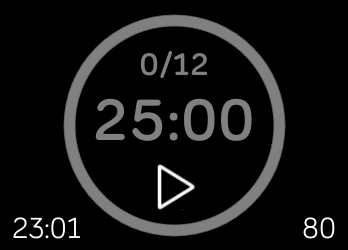
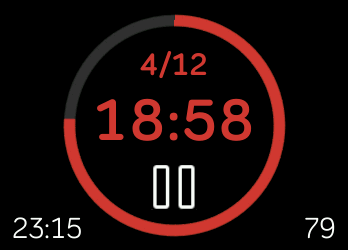
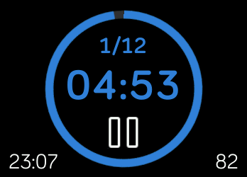
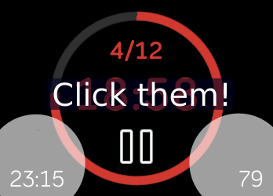

# Pomodoro Clockface

Pomodoro yourself whenever you want!

## Description

Features:

1. Start/Pause the timer
2. Skip current interval (When the timer is paused)
3. Reset the timer (When the timer is paused)
4. Notifies you when an interval finished!
5. Switch between time, date, day, or empty on the bottom-left corner (click it!)
6. Show/Hide heart rate on the bottom-right corner (also click it!)

Now it only has one interval setup:

- 25 mins for working interval
- 5 mins for short break interval
- 15 mins for long break interval
- Long break after 4 working intervals
- Timer finished in 12 working intervals

Customized interval setup is coming soon ;)

If you don't want to replace your clockface, you can install the App version of this Pomodoro clock, which is in the app gallery ;)

IMPORTANT NOTE: If you switch to other apps, it will keep counting down the interval, but you will NOT receive the notification (the vibration). This is because Ionic does not allow any app be running in the background currently.
